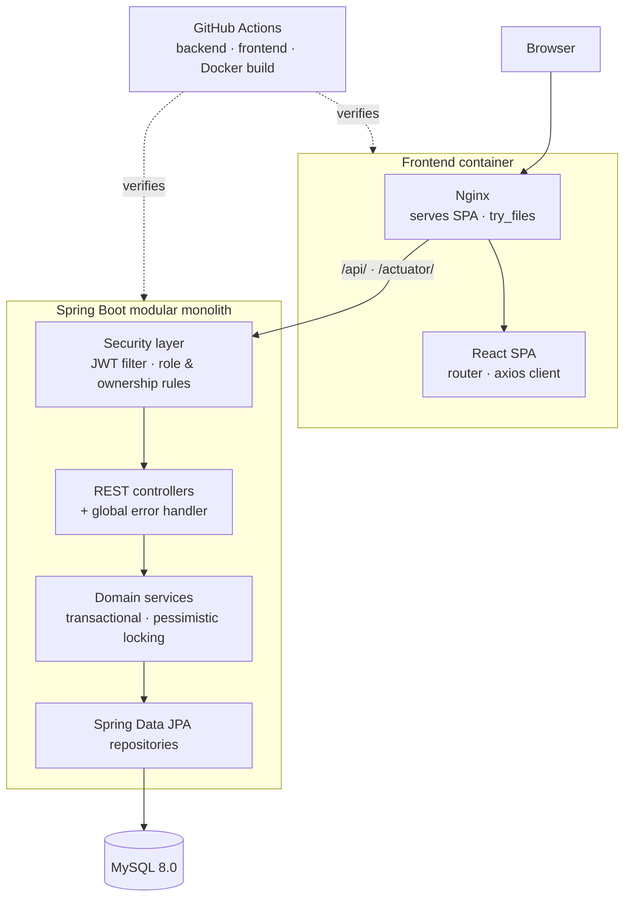

# Stock Management System

A full-stack inventory and stock-transaction management application — Java 21 / Spring Boot API with a React single-page frontend, containerised with Docker and verified in CI against MySQL 8.0.


## Overview

The system tracks products, categories, suppliers and the stock movements between them. It is a
modular monolith: one Spring Boot service exposing a REST API, and a React SPA that consumes it.

The engineering focus is on the parts of an inventory system that are easy to get wrong —
**authorization**, **transactional consistency**, **concurrency safety** and **automated
verification** — rather than on breadth of features. Stock is a shared mutable resource, so every
operation that changes it is serialised at the database level and covered by tests that exercise
real concurrent access.

## Key capabilities

- Product, category and supplier management with low-stock alerts
- Stock transactions: purchase, sale and adjustment, with reversal
- Editable transaction notes, restricted to the recording user or an admin
- Paginated and sorted list endpoints
- User registration, login and self-service profile updates
- Role-based access (ADMIN / USER) with ownership rules
- Dashboard with category and transaction breakdowns
- Currency conversion through an external exchange-rate API
- OpenAPI/Swagger documentation

## Engineering highlights

| Area | What it does |
|---|---|
| **Concurrency-safe stock** | Stock mutations take a pessimistic row lock, so two simultaneous sales cannot oversell. Proven by a test that runs genuinely concurrent transactions. |
| **Atomic reversal** | Deleting a transaction reverses its stock effect in the same transaction, and is refused when the reversal would drive inventory negative. |
| **Ledger preservation** | A product with transaction history cannot be hard-deleted; the audit trail is never cascade-removed. The deletion check uses a locking read so it cannot race a concurrent transaction. |
| **Ownership authorization** | Per-user transaction history and note updates are checked in the service layer against the authenticated principal — never against anything in the request body. |
| **Safe error contracts** | 401, 403, 409 and 500 responses carry fixed, non-disclosing messages. No SQL, constraint, driver or stack detail reaches a client. |
| **Stable pagination** | List endpoints return DTOs plus explicit `page`/`size`/`totalPages`/`totalElements`, instead of serialising a JPA `Page` and leaking entities. |
| **Strict profile updates** | A dedicated request DTO accepts only `email` and `fullName`; identity, role and account-state fields are unbindable and rejected. |
| **Frontend session coordination** | Concurrent 401s share a single token refresh; a failed refresh drains the queue and logs out instead of deadlocking. |
| **MySQL-backed CI** | The full backend suite runs against a real MySQL 8.0 service on every push and pull request — not an in-memory substitute. |

## Architecture



The browser always talks to Nginx, which serves the SPA and proxies only `/api/` and `/actuator/`
to Spring. The backend renders no pages — opening the backend port directly returns API responses,
not the UI.

## Technology stack

**Backend** — Java 21, Spring Boot 3.5.7, Spring Security, Spring Data JPA, MySQL 8.0, JJWT, ModelMapper, springdoc-openapi, Gradle 8.14
**Frontend** — React 19.2, React Router 6, Axios, Chart.js
**Infrastructure** — Docker, Docker Compose, Nginx, GitHub Actions

## Security model

- **Authentication** — stateless JWT access tokens, validated per request against the persisted user
- **Sessions** — persisted refresh-token session handling; one active refresh token per user, revoked on logout
- **Authorization** — role hierarchy (ADMIN inherits USER) plus service-layer ownership checks
- **Account state** — a token belonging to a disabled account is rejected before authentication is established
- **Passwords** — BCrypt hashing; login failures never reveal whether a username exists
- **Brute force** — in-memory, per-instance login lockout after repeated failures
- **Responses** — security failures return fixed JSON messages that disclose nothing about the cause

**Known limitations, by design for this release:** refresh tokens are *not* rotated on each refresh,
so a stolen refresh token stays valid until it expires or the user logs out. The login lockout is
held in memory, so it resets on restart and is not shared across instances. Values in browser
`localStorage` are obfuscated with a key that ships inside the client bundle — that is a speed bump
against casual inspection, not a security boundary.

## API contracts

Swagger UI is served at `/swagger-ui.html` (enabled outside the production profile).

| Status | Meaning |
|---|---|
| `400` | Request validation failed — a single violation returns its own message |
| `401` | `Authentication is required to access this resource.` / `Authentication is invalid.` |
| `403` | `You do not have permission to access this resource.` |
| `409` | Conflict with existing data — duplicate values, ledger history, lock contention |
| `422` | Domain rule refused the operation, e.g. insufficient stock |
| `500` | `An unexpected error occurred.` — details are logged, never returned |

List endpoints return the DTO collection plus `page`, `size`, `totalPages` and `totalElements`.
`PUT /api/users/profile` selects the account from the authenticated principal only; any other field
in the body is rejected.

## Testing and CI

| Suite | Count | Environment |
|---|---|---|
| Backend | **155 tests** | MySQL 8.0 service in GitHub Actions |
| Frontend | **22 tests** across 5 suites | Jest + React Testing Library |
| Frontend build | production build | CI mode, warnings treated as errors |
| Docker | backend and frontend images | built on every push and pull request |

Coverage includes concurrent-oversell, deletion-race and atomicity integration tests that run real
transactions against the database rather than mocks.

```bash
./gradlew test          # backend
cd frontend && npm test # frontend
```

## Running with Docker Compose

```bash
git clone https://github.com/mrblackcoder/Stock_Management.git
cd Stock_Management
cp .env.docker.example .env   # then edit .env and set your own secrets
docker compose up --build
```

| Service | URL |
|---|---|
| Application UI (Nginx) | http://localhost |
| Backend API | http://localhost:8080/api |
| Swagger UI | http://localhost:8080/swagger-ui.html |
| Health check | http://localhost:8080/actuator/health |

Open the application UI on port 80 — the backend serves the API only, so its root path is not the
user interface. MySQL is published on `localhost:3306` for local inspection.

## Local development

**Backend** (JDK 21 — the Gradle 8.14 wrapper does not support JDK 25/26):

```bash
cp .env.example .env   # set DB_PASSWORD and JWT_SECRET
./gradlew bootRun
```

Create the database first: `CREATE DATABASE inventory_management_db;`

**Frontend** (Node.js 20+):

```bash
cd frontend
npm install
npm start
```

The first admin account is created on startup from `ADMIN_PASSWORD`. No default credentials ship in
this repository — set your own.

## Environment configuration

| File | Purpose |
|---|---|
| `.env.example` | Local backend run — `DB_PASSWORD`, `JWT_SECRET` |
| `.env.docker.example` | Full Compose stack — database, JWT, admin and CORS settings |
| `frontend/.env.example` | Frontend build variables |
| `frontend/.env.production` | Public build values used by the Docker/Nginx image |

`JWT_SECRET`, `ADMIN_PASSWORD` and the database passwords are real secrets and must be supplied per
environment. `REACT_APP_*` variables are **not** secrets: Create React App compiles them into the
browser bundle, so anything placed there is readable by every visitor. No real credential is
committed to this repository.

## Project status

Feature-complete for its intended scope. The remaining items on the roadmap — refresh-token rotation
with reuse detection, persistent or distributed login lockout, and a stricter transaction-read
policy — are deliberately outside this release rather than overlooked; each is a considered
trade-off for a single-instance portfolio application.

## Documentation

- [Architecture](./docs/ARCHITECTURE.md)
- [Database schema](./docs/DATABASE_SCHEMA.md)
- [Deployment guide](./DEPLOYMENT_GUIDE.md)

## Author

**Mehmet Taha Boynikoğlu** — https://github.com/mrblackcoder

---

**License:** MIT — see [LICENSE](./LICENSE)
