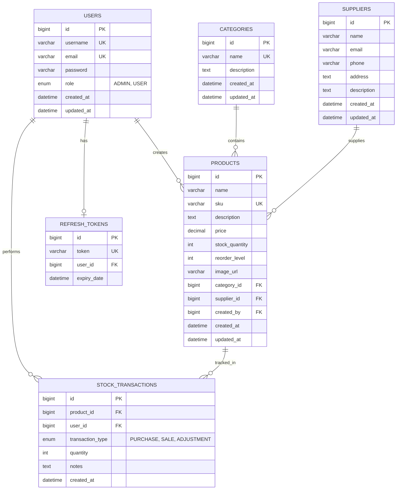

# 📊 Database Schema - Stock Management System

## Entity Relationship Diagram (Mermaid)



## Table Descriptions

### 1. USERS
Stores user account information with role-based access control.

| Column | Type | Constraints | Description |
|--------|------|-------------|-------------|
| id | BIGINT | PK, AUTO_INCREMENT | Unique identifier |
| username | VARCHAR(50) | UNIQUE, NOT NULL | Login username |
| email | VARCHAR(100) | UNIQUE, NOT NULL | Email address |
| password | VARCHAR(255) | NOT NULL | BCrypt hashed password |
| role | ENUM | NOT NULL | ADMIN or USER |
| created_at | DATETIME | NOT NULL | Creation timestamp |
| updated_at | DATETIME | | Last update timestamp |

### 2. CATEGORIES
Product categories for organization.

| Column | Type | Constraints | Description |
|--------|------|-------------|-------------|
| id | BIGINT | PK, AUTO_INCREMENT | Unique identifier |
| name | VARCHAR(100) | UNIQUE, NOT NULL | Category name |
| description | TEXT | | Category description |
| created_at | DATETIME | NOT NULL | Creation timestamp |
| updated_at | DATETIME | | Last update timestamp |

### 3. SUPPLIERS
Vendor/supplier information.

| Column | Type | Constraints | Description |
|--------|------|-------------|-------------|
| id | BIGINT | PK, AUTO_INCREMENT | Unique identifier |
| name | VARCHAR(100) | NOT NULL | Supplier name |
| email | VARCHAR(100) | | Contact email |
| phone | VARCHAR(20) | | Contact phone |
| address | TEXT | | Physical address |
| description | TEXT | | Additional notes |
| created_at | DATETIME | NOT NULL | Creation timestamp |
| updated_at | DATETIME | | Last update timestamp |

### 4. PRODUCTS
Main inventory items.

| Column | Type | Constraints | Description |
|--------|------|-------------|-------------|
| id | BIGINT | PK, AUTO_INCREMENT | Unique identifier |
| name | VARCHAR(200) | NOT NULL | Product name |
| sku | VARCHAR(50) | UNIQUE, NOT NULL | Stock Keeping Unit |
| description | TEXT | | Product description |
| price | DECIMAL(10,2) | NOT NULL | Unit price (TRY) |
| stock_quantity | INT | NOT NULL, DEFAULT 0 | Current stock level |
| reorder_level | INT | DEFAULT 10 | Low stock threshold |
| image_url | VARCHAR(500) | | Product image URL |
| category_id | BIGINT | FK → CATEGORIES | Category reference |
| supplier_id | BIGINT | FK → SUPPLIERS | Supplier reference |
| created_by | BIGINT | FK → USERS | Creator user |
| created_at | DATETIME | NOT NULL | Creation timestamp |
| updated_at | DATETIME | | Last update timestamp |

### 5. STOCK_TRANSACTIONS
Tracks all inventory movements.

| Column | Type | Constraints | Description |
|--------|------|-------------|-------------|
| id | BIGINT | PK, AUTO_INCREMENT | Unique identifier |
| product_id | BIGINT | FK → PRODUCTS, NOT NULL | Product reference |
| user_id | BIGINT | FK → USERS, NOT NULL | User who performed |
| transaction_type | ENUM | NOT NULL | PURCHASE, SALE, ADJUSTMENT |
| quantity | INT | NOT NULL | Units affected |
| notes | TEXT | | Transaction notes |
| created_at | DATETIME | NOT NULL | Transaction timestamp |

### 6. REFRESH_TOKENS
JWT refresh token storage for secure authentication.

| Column | Type | Constraints | Description |
|--------|------|-------------|-------------|
| id | BIGINT | PK, AUTO_INCREMENT | Unique identifier |
| token | VARCHAR(500) | UNIQUE, NOT NULL | Refresh token value |
| user_id | BIGINT | FK → USERS, NOT NULL | Token owner |
| expiry_date | DATETIME | NOT NULL | Token expiration |

## Relationships Summary

| Parent | Child | Relationship | Description |
|--------|-------|--------------|-------------|
| USERS | PRODUCTS | 1:N | User creates many products |
| USERS | STOCK_TRANSACTIONS | 1:N | User performs many transactions |
| USERS | REFRESH_TOKENS | 1:1 | User has one active refresh token |
| CATEGORIES | PRODUCTS | 1:N | Category contains many products |
| SUPPLIERS | PRODUCTS | 1:N | Supplier provides many products |
| PRODUCTS | STOCK_TRANSACTIONS | 1:N | Product has many transactions |

## Indexes

```sql
-- Primary Indexes (auto-created)
CREATE INDEX idx_products_category ON products(category_id);
CREATE INDEX idx_products_supplier ON products(supplier_id);
CREATE INDEX idx_products_sku ON products(sku);
CREATE INDEX idx_transactions_product ON stock_transactions(product_id);
CREATE INDEX idx_transactions_user ON stock_transactions(user_id);
CREATE INDEX idx_transactions_type ON stock_transactions(transaction_type);
CREATE INDEX idx_refresh_tokens_user ON refresh_tokens(user_id);
```

## Sample Data

```sql
-- Default Admin User (password: Admin@123!Secure)
INSERT INTO users (username, email, password, role, created_at) VALUES 
('admin', 'admin@stockmanagement.com', '$2a$10$...', 'ADMIN', NOW());

-- Sample Categories
INSERT INTO categories (name, description, created_at) VALUES
('Electronics', 'Electronic devices and components', NOW()),
('Furniture', 'Office and home furniture', NOW());

-- Sample Suppliers
INSERT INTO suppliers (name, email, phone, created_at) VALUES
('Tech Supplies Inc.', 'contact@techsupplies.com', '+90 555 123 4567', NOW());
```
